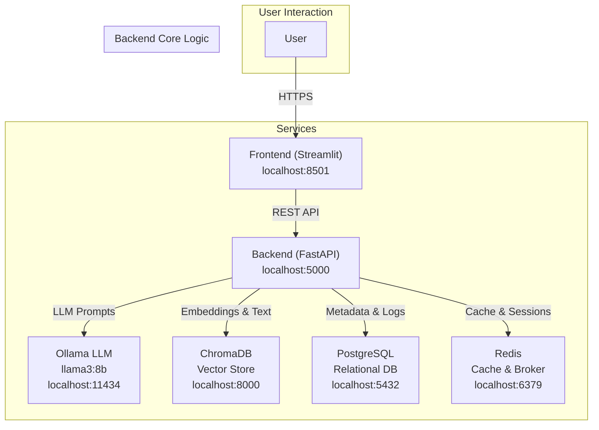
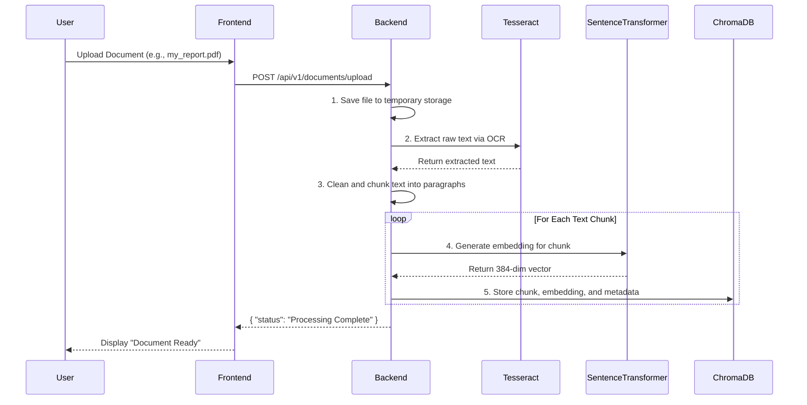

# Insight AI: Technical Documentation

This document provides a detailed technical overview of the Insight AI system architecture, data flows, and core components.

## 1. High-Level System Architecture

Insight AI is built on a microservices architecture, fully containerized with Docker Compose. This design ensures separation of concerns, scalability, and maintainability. Each service communicates over a shared Docker network.



2. Data Ingestion and Processing Flow (RAG Indexing)
This flow describes how documents are processed and prepared for retrieval. The goal is to convert unstructured documents into a searchable, structured format (vector embeddings).


## 2\. Data Ingestion and Processing Flow (RAG Indexing)

This flow describes how documents are processed and prepared for retrieval. The goal is to convert unstructured documents into a searchable, structured format (vector embeddings).



**Workflow Steps:**

1.  **Upload:** The user uploads a document via the Streamlit frontend.
2.  **Text Extraction:** The backend receives the file. If it's an image-based format like a scanned PDF, it uses the **Tesseract OCR** library to extract raw text. For text-based files, it uses appropriate parsers.
3.  **Chunking:** The raw text is segmented into smaller, semantically meaningful chunks (e.g., paragraphs). This is critical for retrieval accuracy, as it ensures the context provided to the LLM is focused.
4.  **Embedding:** Each text chunk is passed to the **Sentence-Transformer (`all-MiniLM-L6-v2`)** model. This model converts the text into a 384-dimensional vector embedding that numerically represents its semantic meaning.
5.  **Storage:** The original text chunk, its corresponding vector embedding, and relevant metadata (e.g., source filename, page number) are stored as a record in the **ChromaDB** vector database.

## 3\. Query and Response Workflow (Multi-Tool Orchestration)

**Workflow Steps:**

1.  **Query Analysis:** The user's query is received by the backend. The LangChain **Orchestrator/Agent** analyzes the query's intent.
2.  **Tool Selection & Execution:**
      * **DocumentRetrieverTool:** The orchestrator determines that internal knowledge is required. It invokes this tool, which converts the user's query into an embedding and searches **ChromaDB** for the most similar text chunks from the ingested documents.
      * **WebSearchTool (Conditional):** If the query suggests a need for recent information or facts not present in the documents (e.g., "What is the current stock price of X mentioned in the report?"), this tool would be triggered to query an external search API.
3.  **Information Aggregation:** The orchestrator collects the results from all used tools (e.g., text chunks from ChromaDB, snippets from web search).
4.  **Response Synthesis:**
      * The aggregated information is passed to the **ResponseSynthesizerTool**.
      * This tool constructs a detailed, final prompt containing the original question and all the retrieved context.
      * The prompt is sent to the **Ollama LLM**.
5.  **Final Answer:** The LLM generates a comprehensive answer based on the provided context. The synthesizer formats this response, attaches source information (e.g., which documents the context came from), and sends it back to the user via the frontend.

## 4\. Database Schema (PostgreSQL)

The relational database stores structured application data. Below is a simplified schema overview.

  * **users**
      * `id` (PK, UUID)
      * `email` (VARCHAR, UNIQUE)
      * `hashed_password` (VARCHAR)
      * `created_at` (TIMESTAMP)
  * **workspaces**
      * `id` (PK, UUID)
      * `user_id` (FK to users.id)
      * `name` (VARCHAR)
      * `created_at` (TIMESTAMP)
  * **documents**
      * `id` (PK, UUID)
      * `workspace_id` (FK to workspaces.id)
      * `file_name` (VARCHAR)
      * `storage_path` (VARCHAR)
      * `status` (VARCHAR: e.g., 'uploading', 'processing', 'ready', 'error')
      * `uploaded_at` (TIMESTAMP)
  * **chat\_sessions**
      * `id` (PK, UUID)
      * `workspace_id` (FK to workspaces.id)
      * `created_at` (TIMESTAMP)
  * **chat\_messages**
      * `id` (PK, UUID)
      * `session_id` (FK to chat\_sessions.id)
      * `role` (VARCHAR: 'user' or 'assistant')
      * `content` (TEXT)
      * `sources_json` (JSONB)
      * `created_at` (TIMESTAMP)

## 5\. Local Development and Tooling

  * **Database Migrations (Alembic):** Database schema changes are managed by Alembic. To create a new migration, run the following command inside the backend container:
    ```
    docker-compose exec backend alembic revision --autogenerate -m "Your migration message"
    ```
    To apply migrations upon startup, the backend can be configured to run `alembic upgrade head`.
  * **Interacting with Services:**
      * **PostgreSQL:** Connect using a client like `psql` or DBeaver with the credentials from the `docker-compose.yml` file (`host=localhost`, `port=5432`).
      * **Redis:** Use `redis-cli` to inspect the cache:
        ```
        docker-compose exec redis redis-cli
        ```
      * **API Testing:** The backend's FastAPI automatically generates interactive API documentation, available at `http://localhost:5000/docs`.

<!-- end list -->
